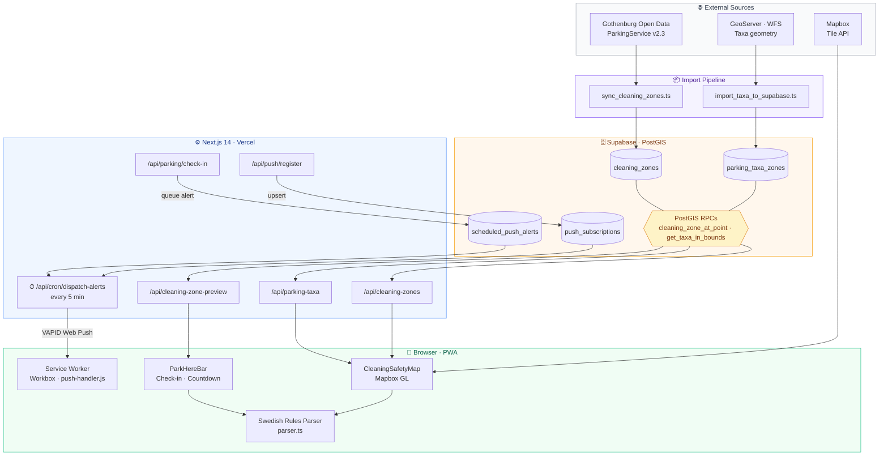

# Gothenburg Parking Guardian

> **Fine prevention, not just parking info.** A production-grade PWA that saves Gothenburg drivers from 1,300 SEK+ fines by combining real geospatial data, a Swedish rules parser, and proactive push alerts — all in a sub-100ms interactive map.

---


## Why This Exists

Parking in Gothenburg is a trap for the uninitiated. Signs say things like `Vardagar 09-18 (09-15) Städning 1:a–3:e torsdag varje månad 09-14` — and getting it wrong costs 1,300 SEK. Existing solutions (the city's own P-karta, Google Maps) show you where to park. They don't tell you **when you'll get fined**.

GPG is built around a single principle: **surface the dangerous exceptions before the user ever parks**, not after.

---

## Differentiators

| What | Why it matters |
|------|----------------|
| **Swedish Rules Parser** (`src/lib/parser.ts`) | Converts raw Swedish sign text into typed, machine-readable `ParkingSchedule` JSON. Handles `Vardagar`, `Lördag`, `Röd dag`, bracket exceptions, and multi-rule strings. |
| **Real Gothenburg geometry** | Taxa zone polygons are imported from the city's live GeoServer/WFS pipeline (`scripts/import_taxa_to_supabase.ts`), not hand-drawn or approximated. |
| **PostGIS point-in-zone** | `cleaning_zone_at_point`, `get_taxa_in_bounds` and related RPCs run spatial queries server-side via Supabase. No client-side polygon math on large datasets. |
| **DST-aware Stockholm time** | All temporal decisions (schedule windows, alert dispatch, cron) use `Europe/Stockholm` with correct DST offsets — never UTC shortcuts. |
| **Proactive Web Push (VAPID)** | Alerts fire **12 h and 1 h before** cleaning starts, while the car is still parked safely. Not a post-incident notification. |
| **Installable PWA** | Service worker + `app/manifest.ts` = full offline shell, home-screen install, background push delivery. |

---

## Architecture



---

## Core Features

### 1. Cleaning Zone Overlay
- Fetches city `CleaningZones` via `scripts/sync_cleaning_zones.ts` into Supabase.
- Map renders LineString / MultiLineString / Polygon via a GeoJSON source + Mapbox line layer.
- Color-coded by **time-to-cleaning**: red (< 1 h), amber (< 12 h), green (safe).

### 2. Parking Taxa (Taxeområde) Visualization
- Real geometry imported from Gothenburg's open data WFS/GeoServer endpoint into `parking_taxa_zones`.
- `GET /api/parking-taxa?bbox=...` returns FeatureCollection; Mapbox line layer colored by `taxa_name` and hourly rate.
- Supports taxa comparison at zone borders — the exact moment a cheaper zone begins.

### 3. Park Here Check-In
- One-tap check-in stores a `ParkingSession` client-side.
- At check-in: queries taxa at GPS point, previews the next cleaning window, and inserts a row into `scheduled_push_alerts` for 12 h and 1 h pre-cleaning delivery.
- Session survives page refresh; countdown timer shows remaining safe-park time.

### 4. Proactive Push Alerts
- `POST /api/push/register` upserts VAPID `PushSubscription`.
- `GET /api/cron/dispatch-alerts` (Vercel Cron, every 5 min) queries due alerts and sends Web Push via `web-push` library.
- `public/push-handler.js` (loaded via Workbox `importScripts`) handles `push` and `notificationclick` events in the service worker.

### 5. Swedish Parking Rules Parser
- `src/lib/parser.ts`: tokenizes Swedish schedule strings → structured `DayRule[]` with `{ day, startHour, endHour, isException }`.
- Handles: `Vardagar`, `Lördag`, `Söndag`, `Röd dag`, parenthesized bracket exceptions, and multi-segment rules separated by `,` or `.`.
- Consumed by cleaning-safety helpers and the check-in preview card.

### 6. Resident Zone (Boendeparkering) — Step 2, In Progress
- `ResidentZoneContext` stores the user's home zone (e.g., Zone L, Zone V) in `localStorage`.
- UI modal lets the user set / change zone.
- Planned: taxa pricing override to `Free / Discounted` when the parked point is inside the resident zone; distinct map highlight layer for "my" areas.

---

## Tech Stack

| Layer | Choice | Reason |
|-------|--------|--------|
| Framework | Next.js 14 (App Router) | Server components for zero-client DB calls; file-based API routes |
| Language | TypeScript strict | Spatial + schedule types demand compile-time guarantees |
| Database | Supabase + PostGIS | Managed PG, RPC support, real-time hooks, row-level security |
| Maps | Mapbox GL JS (`react-map-gl`) | Expression-based layer styling for dynamic taxa coloring |
| Styling | Tailwind CSS | Nordic Minimalist design tokens (see `AI.md §3`) |
| Icons | Lucide React | Consistent, tree-shakeable SVG icon set |
| Push | Web Push / VAPID | Browser-native, no third-party push service dependency |
| PWA | `@ducanh2912/next-pwa` | Workbox precaching + custom push handler injection |
| Spatial scripts | `ts-node` + `node-fetch` | WFS → GeoJSON → Supabase bulk upsert pipeline |

---

## Quick Start

```bash
npm install

# Copy and fill in the required env vars (see DEPLOYMENT.md)
cp .env.example .env.local

npm run dev
# → http://localhost:3003
```

Minimum required in `.env.local`:

```env
NEXT_PUBLIC_MAPBOX_TOKEN=pk.eyJ1...
NEXT_PUBLIC_SUPABASE_URL=https://<ref>.supabase.co
NEXT_PUBLIC_SUPABASE_ANON_KEY=eyJ...
SUPABASE_SERVICE_ROLE_KEY=eyJ...
```

Web Push and cron require additional VAPID + `CRON_SECRET` vars — see `DEPLOYMENT.md`.

---

## Database Setup

Apply migrations in order (filenames are the order key):

```bash
# From your Supabase project SQL editor, or via the CLI:
supabase db push
```

Migrations live in `supabase/migrations/` and cover: PostGIS extension, `cleaning_zones`, `parking_taxa_zones`, `push_subscriptions`, `scheduled_push_alerts`, and all RPC definitions (`cleaning_zone_at_point`, `get_taxa_in_bounds`, etc.).

---

## Scripts

| Command | Description |
|---------|-------------|
| `npm run dev` | Dev server on port **3003** |
| `npm run build` | Production build |
| `npm run start` | Run production server |
| `npm run lint` | Next.js ESLint |
| `npm run import-taxa` | Bulk import taxa geometries from WFS → Supabase |
| `npm run sync-cleaning-zones` | Pull latest cleaning zones from city API → Supabase |
| `npm run verify-cleaning-zone` | CLI: point-in-zone sanity check for a given lat/lng |

---

## Roadmap

- [x] **Step 0** — PostGIS infrastructure, cleaning zones end-to-end
- [x] **Step 1** — Taxa visualization with real geometry (WFS import pipeline)
- [ ] **Step 2** — Resident zone (Boendeparkering) pricing override + map emphasis *(active)*
- [ ] **Step 3** — Time Slider: temporal simulation, morning-rush prediction
- [ ] **Step 4** — Proximity finder: nearest cheaper / safe zone within 20–100 m (Turf.js)

---

## Docs

- **`DEPLOYMENT.md`** — Vercel env vars, cron setup, service worker / PWA notes, VAPID key generation
- **`AI.md`** — Product goals, Gothenburg Parking API reference (`data.goteborg.se/ParkingService/v2.3/`), design tokens, full roadmap

---

## License

Private / project use unless stated otherwise.


