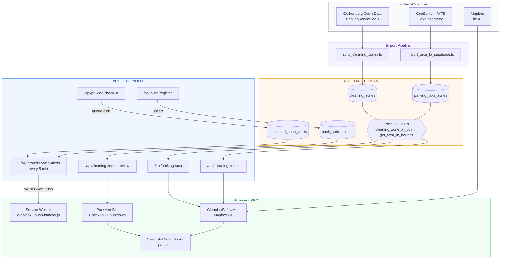

<div align="center">

# Gothenburg Parking Guardian

**Fine prevention, not just parking info.**

A production-grade Progressive Web App that saves Gothenburg drivers from 1,300 SEK+ fines by combining real geospatial data, a custom Swedish parking rules parser, and proactive push alerts — all within a sub-100ms interactive map.

[](https://nextjs.org/)
[](https://www.typescriptlang.org/)
[](https://supabase.com/)
[](https://www.mapbox.com/)
[](https://web.dev/progressive-web-apps/)

</div>

---

## The Problem

Parking in Gothenburg is a trap. Signs read things like:

> `Vardagar 09–18 (09–15) Städning 1:a–3:e torsdag varje månad 09–14`

Getting it wrong costs **1,300 SEK**. The city's own P-karta and Google Maps show you *where* to park. They don't tell you *when you'll get fined*.

**GPG surfaces the dangerous exceptions before you park — not after.**

---

## App Preview

<div align="center">

### Starting Screen


<br><br>

### Checking Cleaning Schedule
*Color-coded street lines show time-to-cleaning: green (safe) · amber (< 12 h) · red (< 1 h)*


<br><br>

### Selecting Your Residential Parking Zone
*Set your home zone once — the app remembers it across sessions*


<br><br>

### Showing Your Residential Parking Zone
*Your zone is highlighted in blue; PostGIS confirms the boundary in real time*


<br><br>

### Free Parking in Your Residential Zone
*Fee confirmed at 0.00 kr — resident benefit applied automatically*


<br><br>

### Calculating Parking Fees Outside Your Zone
*Live fee ticker: elapsed hours × taxa rate, updated every second*


</div>

---

## Key Engineering Highlights

| Challenge | Solution |
|-----------|----------|
| Swedish schedule text is ambiguous free-form | Custom tokenizer in `src/lib/parser.ts` → typed `DayRule[]` with `{ day, startHour, endHour, isException }`. Handles `Vardagar`, `Röd dag`, bracket exceptions, multi-segment strings. |
| Polygon math on thousands of city features is slow client-side | All spatial queries run as PostGIS RPCs (`cleaning_zone_at_point`, `get_taxa_in_bounds`) on the database server. The client receives a flat JSON response. |
| Real geometry, not hand-drawn | Taxa polygons imported from Gothenburg's live **GeoServer / WFS** pipeline (`scripts/import_taxa_to_supabase.ts`). No manual coordinate tracing. |
| Stockholm DST must never drift | Every temporal decision — schedule windows, alert dispatch, Vercel cron — uses `Europe/Stockholm` with correct summer/winter UTC offsets. |
| Alerts must arrive *before* the fine, not after | VAPID Web Push fires **12 h and 1 h before** cleaning starts. Vercel Cron polls `scheduled_push_alerts` every 5 minutes. |
| Works offline and installs on home screen | Workbox precache + `app/manifest.ts` + custom `public/push-handler.js` = full PWA with background push delivery. |

---

## Architecture


```mermaid
flowchart TD
    subgraph EXT["External Sources"]
        OD["Gothenburg Open Data\nParkingService v2.3"]
        WFS["GeoServer · WFS\nTaxa geometry"]
        MB["Mapbox\nTile API"]
    end

    subgraph PIPE["Import Pipeline"]
        S1["sync_cleaning_zones.ts"]
        S2["import_taxa_to_supabase.ts"]
    end

    subgraph DB["Supabase · PostGIS"]
        T1[("cleaning_zones")]
        T2[("parking_taxa_zones")]
        T3[("push_subscriptions")]
        T4[("scheduled_push_alerts")]
        RPC{{"PostGIS RPCs\ncleaning_zone_at_point · get_taxa_in_bounds"}}
        T1 & T2 --- RPC
    end

    subgraph SERVER["Next.js 14 · Vercel"]
        A1["/api/cleaning-zones"]
        A2["/api/parking-taxa"]
        A3["/api/cleaning-zone-preview"]
        A4["/api/parking/check-in"]
        A5["/api/push/register"]
        A6["⏱ /api/cron/dispatch-alerts\nevery 5 min"]
    end

    subgraph CLIENT["Browser · PWA"]
        MAP["CleaningSafetyMap\nMapbox GL"]
        BAR["ParkHereBar\nCheck-in · Countdown"]
        PARSER["Swedish Rules Parser\nparser.ts"]
        SW["Service Worker\nWorkbox · push-handler.js"]
        MAP & BAR --> PARSER
    end

    OD --> S1 --> T1
    WFS --> S2 --> T2
    MB --> MAP

    RPC --> A1 & A2 & A3
    A1 & A2 --> MAP
    A3 --> BAR
    A4 -- "queue alert" --> T4
    A5 -- "upsert" --> T3
    T4 & T3 --> A6
    A6 -- "VAPID Web Push" --> SW

    style EXT    fill:#F9FAFB,stroke:#9CA3AF,color:#374151
    style PIPE   fill:#F5F3FF,stroke:#8B5CF6,color:#4C1D95
    style DB     fill:#FFF7ED,stroke:#F59E0B,color:#78350F
    style SERVER fill:#EFF6FF,stroke:#3B82F6,color:#1E3A8A
    style CLIENT fill:#F0FDF4,stroke:#10B981,color:#065F46
```

---

## Features

### Cleaning Zone Safety Layer
- Fetches `CleaningZones` from Gothenburg Open Data via `scripts/sync_cleaning_zones.ts` into Supabase
- Renders LineString / MultiLineString / Polygon via a GeoJSON source + Mapbox line layer
- Color-coded in real time by **time-to-cleaning**: red (< 1 h) · amber (< 12 h) · green (safe)

### Parking Taxa Visualization
- Real polygon geometry imported from Gothenburg's WFS/GeoServer endpoint into `parking_taxa_zones`
- `GET /api/parking-taxa?bbox=...` returns a GeoJSON `FeatureCollection`; layers colored by `taxa_name` and hourly rate
- Lets you see precisely when you cross into a cheaper or free zone

### One-Tap Check-In with Live Fee Counter
- Stores a `ParkingSession` client-side, survives page refresh
- At check-in: PostGIS RPC confirms the taxa zone, previews the next cleaning window, and queues rows in `scheduled_push_alerts`
- Fee ticks every second: `elapsed hours × taxa rate`

### Proactive Push Alerts
- `POST /api/push/register` upserts VAPID `PushSubscription`
- `GET /api/cron/dispatch-alerts` (Vercel Cron, every 5 min) queries due alerts and sends Web Push via `web-push`
- `public/push-handler.js` handles `push` and `notificationclick` in the service worker — alerts arrive even when the browser is closed

### Swedish Parking Rules Parser
- `src/lib/parser.ts`: tokenizes Swedish schedule strings → typed `DayRule[]`
- Handles: `Vardagar` · `Lördag` · `Söndag` · `Röd dag` · parenthesized bracket exceptions · multi-segment rules

### Resident Zone (Boendeparkering)
- `ResidentZoneContext` stores the user's home zone (e.g., Zone M) in `localStorage`
- Taxa API overrides the displayed fee to `0.00 kr` when the parked point is inside the resident zone
- Distinct blue polygon highlight distinguishes resident coverage from paid zones

---

## Tech Stack

| Layer | Choice | Rationale |
|-------|--------|-----------|
| Framework | **Next.js 14** (App Router) | Server components for zero-client DB calls; file-based API routes for clean separation |
| Language | **TypeScript** (strict) | Spatial + schedule types demand compile-time guarantees |
| Database | **Supabase + PostGIS** | Managed Postgres with RPC support, row-level security, and native geometry types |
| Maps | **Mapbox GL JS** (`react-map-gl`) | Expression-based layer styling for real-time taxa coloring without re-renders |
| Styling | **Tailwind CSS** | Nordic minimalist design — white base, orange/red warnings, green safe states |
| Icons | **Lucide React** | Tree-shakeable, consistent SVG icon set |
| Push | **Web Push / VAPID** | Browser-native alerts with no third-party push service dependency |
| PWA | **`@ducanh2912/next-pwa`** | Workbox precaching + custom service-worker injection |
| Scripts | **`tsx` + `node-fetch`** | WFS → GeoJSON → Supabase bulk upsert pipeline in TypeScript |

---

## Roadmap

- [x] **Step 0** — PostGIS infrastructure, cleaning zones end-to-end
- [x] **Step 1** — Taxa visualization with real WFS geometry
- [x] **Step 2** — Resident zone (Boendeparkering) pricing override + map emphasis
- [ ] **Step 3** — Time Slider: temporal simulation, morning-rush prediction
- [ ] **Step 4** — Proximity finder: nearest cheaper / safe zone within 20–100 m (Turf.js)

---

## Quick Start

```bash
npm install
cp .env.example .env.local   # fill in the required vars below
npm run dev
# → http://localhost:3003
```

**Minimum `.env.local`:**

```env
NEXT_PUBLIC_MAPBOX_TOKEN=pk.eyJ1...
NEXT_PUBLIC_SUPABASE_URL=https://<ref>.supabase.co
NEXT_PUBLIC_SUPABASE_ANON_KEY=eyJ...
SUPABASE_SERVICE_ROLE_KEY=eyJ...
```

Web Push and cron require additional VAPID + `CRON_SECRET` vars — see [`DEPLOYMENT.md`](DEPLOYMENT.md).

---

## Database Setup

```bash
# Apply all migrations via the Supabase CLI:
supabase db push
```

Migrations in `supabase/migrations/` cover: PostGIS extension, `cleaning_zones`, `parking_taxa_zones`, `push_subscriptions`, `scheduled_push_alerts`, and all RPC definitions.

---

## Scripts

| Command | Description |
|---------|-------------|
| `npm run dev` | Dev server on port 3003 |
| `npm run build` | Production build |
| `npm run lint` | Next.js ESLint |
| `npm run import-taxa` | Bulk import taxa polygons from WFS → Supabase |
| `npm run sync-cleaning-zones` | Pull latest cleaning zones from city API → Supabase |
| `npm run verify-cleaning-zone` | CLI sanity check: point-in-zone for a given lat/lng |

---

## Docs

- **[`DEPLOYMENT.md`](DEPLOYMENT.md)** — Vercel env vars, cron setup, PWA / service worker notes, VAPID key generation

---

<div align="center">

Built with care in Gothenburg · [BitnoorLee](https://github.com/BitnooriLee)

</div>
